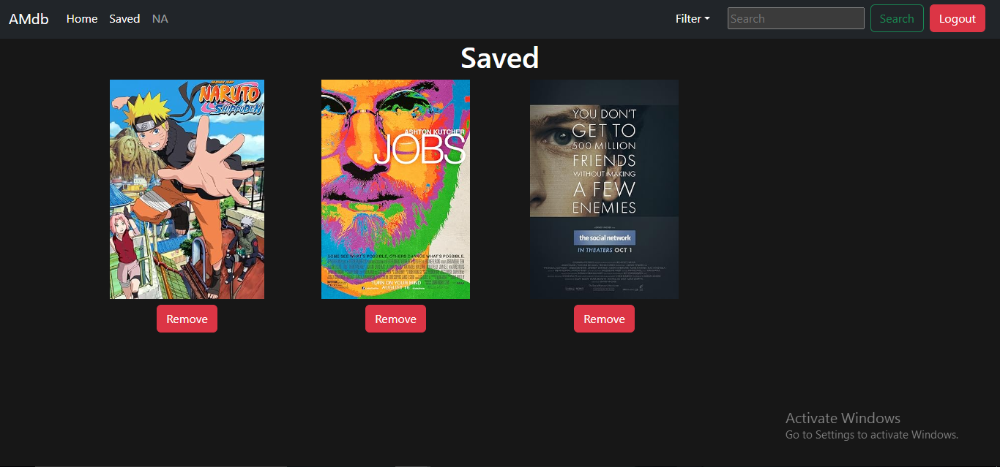

# Imdb Clone
This is a clone of the IMDB website. It is a single page application built using React. It uses the OMDB API to fetch movie data. The elements are created by me, or used from web sources that are later edited as per the requirements. The application is not perfect like imdb as the API provides with basic data fetching and searching functionality. There is a Signup and Login option too that allows a user to save there intrested items in watch later which is managed in both client and server side too. The UI is simple to use below are some screenshots of the application as it is not about to deployed as of now.

# Screenshots

